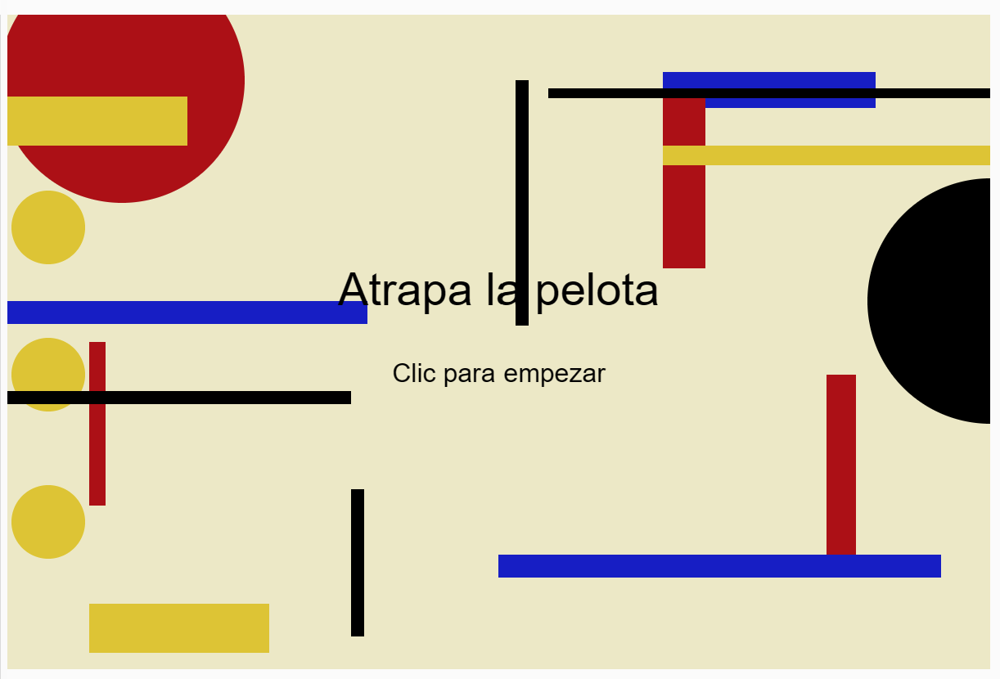
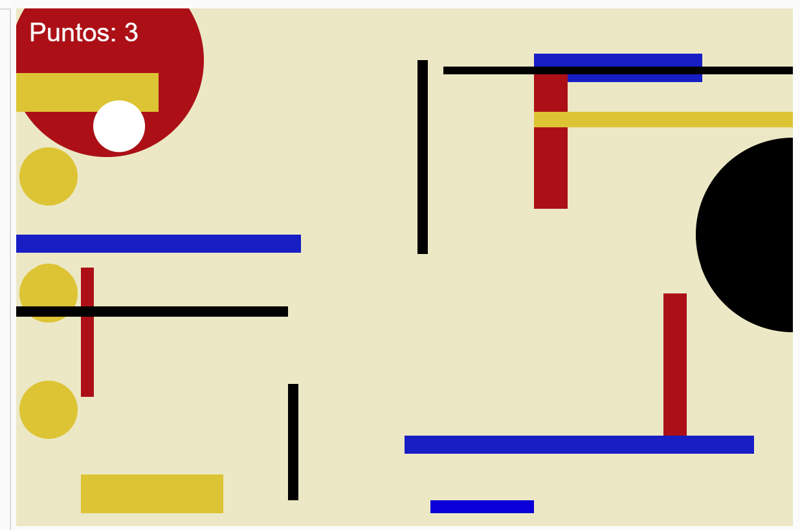
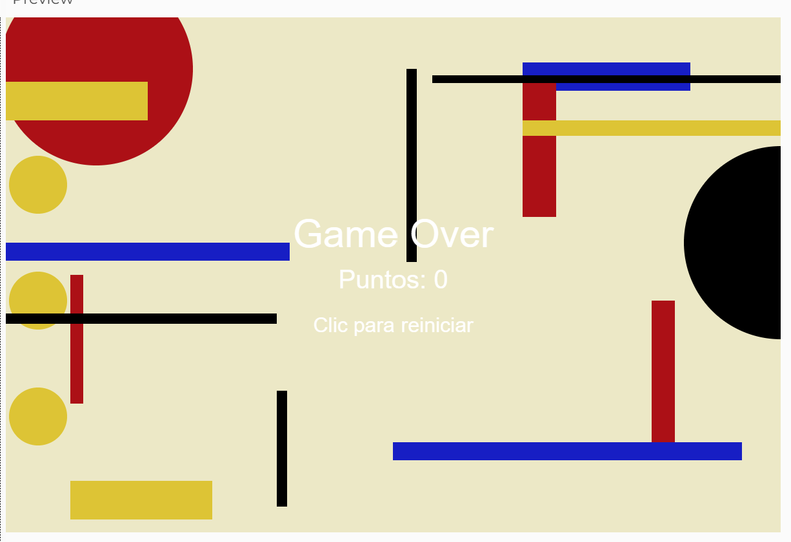

# Examen-Pensamiento-Computacional
Aquí se encuentra todo el trabajo realizado para el examen final de Pensamiento Computacional
[link](https://editor.p5js.org/catalina.millan/full/pOpQZzqaC)

**Link editable**
[link](https://editor.p5js.org/catalina.millan/sketches/pOpQZzqaC)

-Atrapa la Pelota

-Alumna: Catalina Millán

-Este es un pequeño juego interactivo, donde debes guiar la barra azul inferior a traves del eje X para atrapar la pelota de color blanco y vas sumando puntos.

-**Qué es el proyecto**
-El proyecto es un minijuego 2D interactivo programado en JavaScript utilizando la biblioteca gráfica p5.js. El objetivo del juego es simple: el jugador controla una barra horizontal en la parte inferior de la pantalla y debe moverla para atrapar una pelota que cae desde la parte superior. Cada vez que atrapa la pelota, gana un punto y la pelota vuelve a caer desde una posición aleatoria con una velocidad distinta. Si la pelota toca el borde inferior, el jugador pierde.

-**Qué se ve en pantalla**
-En términos generales, se ve un lienzo de 600x400 píxeles con una estética inspirada en Bauhaus. El flujo del juego presenta tres "pantallas" o estados diferentes a lo largo de la partida:

-Pantalla de Inicio: La primera pantalla que ve el jugador. Muestra el título del juego y las instrucciones para comenzar.

-Pantalla de Juego: La fase de acción donde el jugador controla la barra con el ratón (mouseX) para intentar que la pelota no caiga al vacío, mientras un contador lleva el registro del puntaje.

-Pantalla de Fin (Game Over): Aparece cuando el jugador falla. Muestra un mensaje de derrota, el puntaje final y la instrucción para volver a jugar.

-**Qué elementos visuales aparecen**
-Se puede apreciar un fondo estático inspirado en la Bauhaus, elementos interactivos como la barra del jugador, la pelota que cae desde arriba de forma aleatoria y el marcador de puntuación que va aumentando a medida que el jugador va atrapando las pelotas blancas.

-Artistas visuales:
-Piet Mondrian (1872-1944)

-Composiciones abstractas con líneas negras y colores primarios, búsqueda del "equilibrio universal" mediante geometría, evolución desde el cubismo hacia la abstracción pura, inspiración directa: estructura visual, paleta de colores, composición asimétrica.

-Josef Albers (1888-1976)

-Maestro en Bauhaus, especialista en interacción del color, estudios sobre percepción visual y cómo los colores interactúan, composiciones geométricas modulares y parametrizables, influencia: uso de colores primarios, ritmo visual, variación sistemática.

-Kazimir Malevich (1879-1935)

-Suprematismo: geometría pura como forma de expresión, uso radical de colores primarios sobre fondos neutros, abstracción geométrica llevada al extremo, influencia: abstracción total, formas geométricas fundamentales.

-**Qué datos entran al sistema**
- Movimiento del mouse (mouseX) para controlar la barra.

- Clic del mouse (mousePressed()) para iniciar o reiniciar el juego.

- Números aleatorios (random()) para definir la posición horizontal y la velocidad de la pelota.

- Archivos de sonido cargados con loadSound(). 

-**Cómo se procesan**
- En cada fotograma (draw()), el programa actualiza la posición de la pelota sumando su velocidad.

- Compara la posición de la pelota con la de la barra para detectar si fue atrapada.

- Verifica si la pelota salió de la pantalla para determinar si el jugador perdió.

- Según el estado del juego (inicio, jugando o fin), decide qué debe mostrar en pantalla.

-**Cómo se transforma**
- La posición del mouse se transforma en el movimiento de la barra.

- La posición de la pelota cambia continuamente al aumentar su coordenada y.

- Cuando se atrapa la pelota, el puntaje aumenta, la pelota vuelve al inicio con una nueva posición y una nueva velocidad aleatoria.

- Cuando la pelota cae fuera de la pantalla, el estado cambia de "jugando" a "fin".

-**Qué respuestas producen**
- Se dibujan en pantalla el fondo, la barra, la pelota y el puntaje actualizado.

- Se muestran mensajes de "Atrapa la pelota", "Game Over" o "Clic para reiniciar", según corresponda.

- Se reproducen sonidos al iniciar el juego, al atrapar la pelota y al perder.

- El juego responde visualmente y auditivamente a las acciones del jugador.

- 

-**Recursos Multimedia**
Los archivos .wav cargados con loadSound() proporcionan retroalimentación auditiva al iniciar el juego, ganar puntos y perder.

- 
